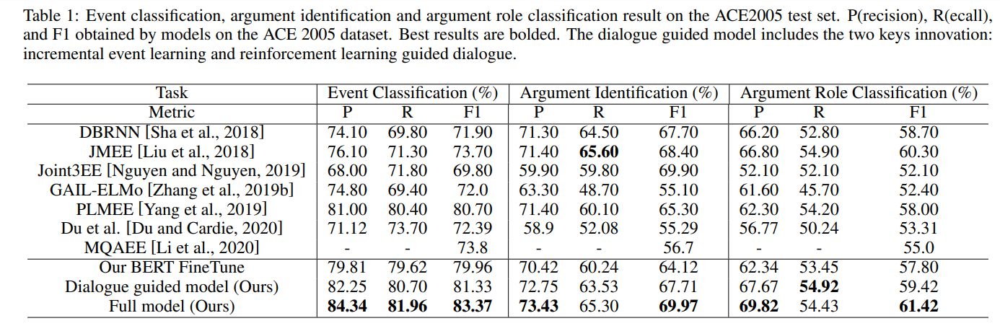
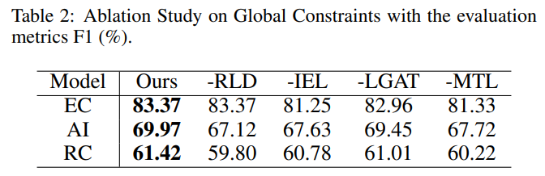

# Reinforcement Argument Ranking Guided Dialogue-based Event Extraction


This is the origin Pytorch implementation of RDEE in the following paper: 
Reinforcement Argument Ranking Guided Dialogue-based Event Extraction

<p align="center">

<br><br>
<b>Figure 1.</b> The architecture of RDEE.
</p>


## Requirements

- Python 3.6
- matplotlib == 3.1.1
- numpy == 1.19.4
- pandas == 0.25.1
- scikit-learn==0.21.3
- transformers==2.5.1
- torch == 1.4.0


Dependencies can be installed using the following command:
```bash
pip install -r requirements.txt
```

## Data
Prepare ACE 2005 dataset.
(Download: https://catalog.ldc.upenn.edu/LDC2006T06. Note that ACE 2005 dataset is not free.)
The required data files should be put into `dataset/` folder.

Download stanford-corenlp model.
```bash
wget http://nlp.stanford.edu/software/stanford-corenlp-full-2018-10-05.zip
unzip stanford-corenlp-full-2018-10-05.zip
```

## Example
Event extraction requires extracting all arguments and their roles corresponding to each event. Doing so is challenging because an event is often associated with more than one argument whose role can vary in different contexts.

<p align="center">

<br><br>
<b>Figure 2.</b> An example on ACE 2005.
</p>


## Usage

```bash

# Settings
1) Event Classification: TC\pybert\configs\basic_config.py
2) Argument Extraction: AI_RC\config\args.py

# Event Classification
1) Preprocess: python TC_preprocess.py
2) Data partition: python run_bert.py --do_data to preprocess data
3) Train: python run_bert.py --do_train --save_best
4) Test: python run_bert.py --do_test

# Argument Extraction
1) Preprocess: python AI_RC_preprocess.py
2) Data partition: python get_data.py
3) Train: python train_start.py
4) Test: python test.py

```

## Results

We evaluate event classification (EC), argument identification (AI), and role classification (RC) performance on the ACE dataset. The overall performance of our approach compared against the baseline methods is reported in Table 1, where the best results are shown in bold and “–” means not available. 
<p align="center">

<br><br>
<b>Figure 3.</b> Event classification, argument identification and argument role classification result on the ACE2005 test set.
</p>

To demonstrate the key designs of our model, we conduct ablation tests by evaluating four variants in Table 2. The result shows that the four variants are significantly valuable
in EC, AI, and RC tasks.
<p align="center">

<br><br>
<b>Figure 4.</b> Ablation Study on Global Constraints.
</p>


